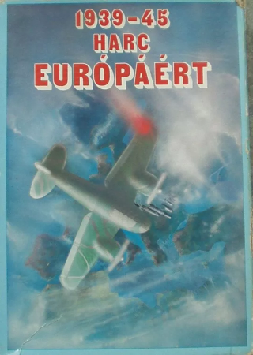
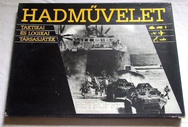
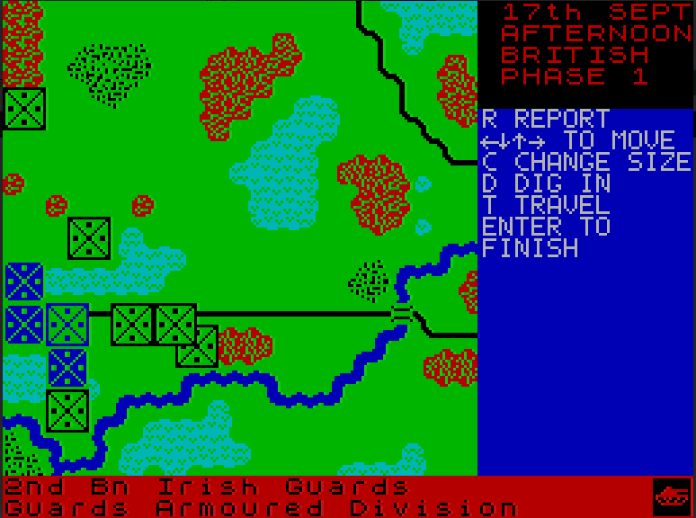
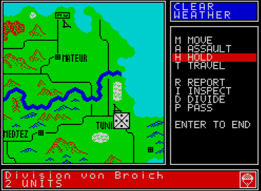

Az első stratégiai játék, amivel találkoztam szerintem a sakk volt. 7-8 éves lehettem, amikor megtanultam játszani és aztán egészen sokáig aktívan sakkoztam is.

A következő a Harc Európáért volt. Ez egy 1986-ban megjelent táblás stratégiai játék, ami valószínűleg az első lehetett az országban ebben a kategóriában. Bár sokat játszottam vele sajnos nekem nem volt meg. Azóta persze szert tettem egy jó állapotú példányra. Ez a játék volt, ami miatt igazán beleszerettem a táblás wargamek-be.

 

Időben valahol ezen a környéken jelent meg a Hadművelet című társas is. Ebből már volt saját példányom is, de a szabályait túl egyszerűnek találtam, így jó pár barkács szabályt alkalmaztam. A Harc Európárt összetettségét így sem értem el így nekem ez a játék inkább csalódás volt.

Nyugaton a táblás wargamek nem számítottak kuriózumnak, de ezek létezéséről keveset tudtam - oké kevés az jelen esetben a semmi volt -, amíg nem olvastam talán az 576 KByte magazinban róluk jóval később.

## Arnhem és társai az RT Smith trilógai

Aztán találkoztam az **Arnhem** című ZX Spectrum 48K játékkal. Először csak a **Sinclair Spectrum Játék és Program** könyvek egyikének lapjain - ez a kiadvány ma már jószerivel értelmezhetetlen lenne a mai világban - majd magával a programmal is.

A Market-Garden hadművelet feldolgozása, 1944. Egyszerűen gyönyörű:

Elképzelhetetlen mennyiségű időt öltem ebbe a játékba. A mai napig az Arnhemben megtalált élményhez (és kicsit későbbi Vulcanban ugyanattól a fejlesztőtől) mérem a stratégia játékokat.

Vulcan a másik Speccy játék, amibe mérhetetlen mennyiségű időt öltem (1942 vége 43 eleje Tunézia):

A **Spectrum Világban** találkoztam az Arnhem testvérével a Vulcannal. Ez volt az első játék, amiért fizettem. Jó hát nem éppen a hivatalos verzióért, hanem a Spectrum Világtól rendelhető másolt játékgyűjtemény egyik kazettájáért. Újabb dolog, ami megint csak nehezen magyarázható 2026-ban.

**R.T. Smith** a CSS-nek fejlesztette még ugyanezzel a motorral a 41-42-es észak-afrikai hadműveletekez feldolgozó **Desert Rats** című játékot is, de ezzel sajnos csak jóval később tudtam már emulátorban vagy DOSBox-ban játszani.

A trilógia megjelent DOS-ra a neten ez a verzió is könnyen felkutatható és letölthet. DOSBox-ra szüksége lesz azért.

Azóta persze sok körökre osztott stratégiai játék jelent meg, szebb grafikával, jobb kezelhetőséggel, okosabb AI-val, de azt a történelmi stratégiai élményt, amelyet az Arnhem nyújtott egyikben sem találtam. Persze játszottam a Panzer General sorozattal (főként az első résszel mert a többi grafikája nekem zavaró volt - boomer vagyok vállalom), Panzer Corps és társaival, de mindig valahogy visszatalálok az Arnhemhez.
